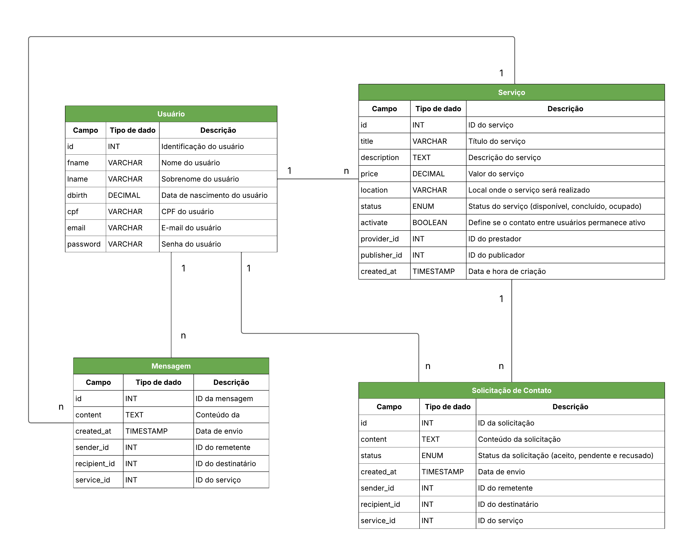

# **Bico - Plataforma de Divulgação de Serviços Informais**

Este projeto consiste no desenvolvimento de uma aplicação web para intermediação de serviços informais (popularmente conhecidos como *bicos* no Brasil). Usuários podem publicar serviços pontuais e outros usuários podem se candidatar para realizá-los.


---

## **1. Etapas do Projeto**

- Levantar os requisitos
- Modelar os dados
- Desenvolver a API (back-end)
- Criar as páginas do front-end
- Integrar API e interface via AJAX

## **2. Levantamento de Requisitos**

| ID | Descrição                                                                                                                           | Tipo |
| -- | ----------------------------------------------------------------------------------------------------------------------------------- | ---- |
| 1  | O sistema deve permitir que um usuário se cadastre informando seu nome, sobrenome, data de nascimento, CPF, e-mail e senha.         | F    |
| 2  | O sistema deve gerar automaticamente um ID, quando realizado o cadastro de um usuário.                                              | F    |
| 3  | O sistema deve permitir que um usuário faça login com seu email e senha.                                                            | F    |
| 4  | O sistema deve permitir que um usuário faça logout de sua conta.                                                                    | F    |
| 5  | O sistema deve permitir que um usuário publique um serviço, informando o título, descrição, preço, localização.                     | F    |
| 6  | O sistema deve gerar automaticamente um ID, quando realizado o cadastro de um serviço.                                              | F    |
| 7  | O sistema deve definir o status inicial de um serviço como "Disponível".                                                            | F    |
| 8  | O sistema deve permitir que o usuário proprietário edite os dados de serviço.                                                       | F    |
| 9  | O sistema deve permitir que um outro usuário possa enviar uma solicitação para o usuário proprietário da publicação.                | F    |
| 10 | O sistema deve permitir que o usuário proprietário da publicação possa aceitar ou recusar solicitações de contato.                  | F    |
| 11 | O sistema deve permitir que o usuário aceito possa se vincular à publicação como prestador do serviço.                              | F    |
| 12 | O sistema deve permitir que apenas usuários autenticados acessem e editem seus próprios dados.                                      | F    |
| 13 | O sistema deve garantir que as publicações possam ser acessadas e editadas por seus respectivos donos.                              | F    |
| 14 | O sistema deve atribuir o usuário proprietário da publicação como "publicador" e o usuário vinculado à publicação como "prestador". | F    |
| 15 | O sistema deve permitir que o publicador e o prestador possam trocar mensagens entre si.                                            | F    |
| 16 | O sistema deve permitir que o publicador e o prestador possam encerrar o contato entre si.                                          | F    |
| 17 | O sistema deve permitir que, após a conclusão do serviço, os usuários possam definir o serviço como "concluído".                    | F    |
| 18 | O sistema deve definir o status de uma publicação de serviço como "ocupada" quando um usuário for aceito como "prestador".          | F    |

---

## 3. **Modelagem de Dados**

### **3.1. Diagrama Entidade-Relacionamento**



### **3.2. Script do banco de dados**

```sql
CREATE TABLE users (
  id INT AUTO_INCREMENT PRIMARY KEY,
  fname VARCHAR(100),
  lname VARCHAR(100),
  dbirth DATE,
  cpf VARCHAR(11) UNIQUE,
  email VARCHAR(50) UNIQUE,
  password VARCHAR(255)
);

CREATE TABLE services (
  id INT AUTO_INCREMENT PRIMARY KEY,
  title VARCHAR(255) NOT NULL,
  description TEXT NOT NULL,
  price DECIMAL(10, 2),
  location VARCHAR(255) NOT NULL,
  status ENUM('Disponível', 'Ocupado', 'Concluído') DEFAULT 'Disponível',
  activate BOOLEAN DEFAULT TRUE,
  publisher_id INT NOT NULL,
  provider_id INT,
  created_at TIMESTAMP DEFAULT CURRENT_TIMESTAMP,
  FOREIGN KEY (publisher_id) REFERENCES users(id) ON DELETE CASCADE,
  FOREIGN KEY (provider_id) REFERENCES users(id) ON DELETE CASCADE
);

CREATE TABLE requests (
  id INT AUTO_INCREMENT PRIMARY KEY,
  content VARCHAR(255) NOT NULL,
  status ENUM('Aceito', 'Pendente', 'Recusado') DEFAULT 'Pendente',
  created_at TIMESTAMP DEFAULT CURRENT_TIMESTAMP,
  sender_id INT NOT NULL,
  recipient_id INT NOT NULL,
  service_id INT NOT NULL, 
  FOREIGN KEY (sender_id) REFERENCES users(id) ON DELETE CASCADE,
  FOREIGN KEY (recipient_id) REFERENCES users(id) ON DELETE CASCADE,
  FOREIGN KEY (service_id) REFERENCES services(id) ON DELETE CASCADE
);

CREATE TABLE messages (
  id INT AUTO_INCREMENT PRIMARY KEY,
  content VARCHAR(255) NOT NULL,
  created_at TIMESTAMP DEFAULT CURRENT_TIMESTAMP,
  sender_id INT NOT NULL,
  recipient_id INT NOT NULL,
  service_id INT, 
  FOREIGN KEY (sender_id) REFERENCES users(id) ON DELETE CASCADE,
  FOREIGN KEY (recipient_id) REFERENCES users(id) ON DELETE CASCADE,
  FOREIGN KEY (service_id) REFERENCES services(id) ON DELETE CASCADE
);
```

---

## **4. Arquitetura de Software**

### **4.1. Ferramentas Utilizadas**

- **Backend:** PHP puro (sem frameworks)
- **Frontend:** HTML, CSS e JavaScript 
- **Banco de Dados:** MySQL (via XAMPP)
- **Comunicação:** Requisições AJAX utilizando o formato **JSON**

### **4.2. Estrutura de Pastas**

```
bico/
│── backend/            # Lógica do back-end (API, autenticação, includes)
|   │── auth/           # Autenticação de usuários (login, logout, cadastro)
|   │── includes/       # Arquivos auxiliares (ex: sessão)
|   │── services/       # Manipulação de  Serviços (CRUD)
|   │── uploads/        # Armazenamento de imagens de serviços (Banco de Dados)
│── db/                 # Configurações do banco de dados, DER, dump
│── frontend/           # Front-end
|   │── assets/         # Recursos adicionais
|   |   │── css/        # Arquivos CSS
|   |   │── images/     # Imagens
|   |   │── js/         # Scripts JavaScript
|   │── pages/          # Páginas HTML
│── index.php           # Ponto de entrada da aplicação
│── README.md           # Descrição do projeto
```